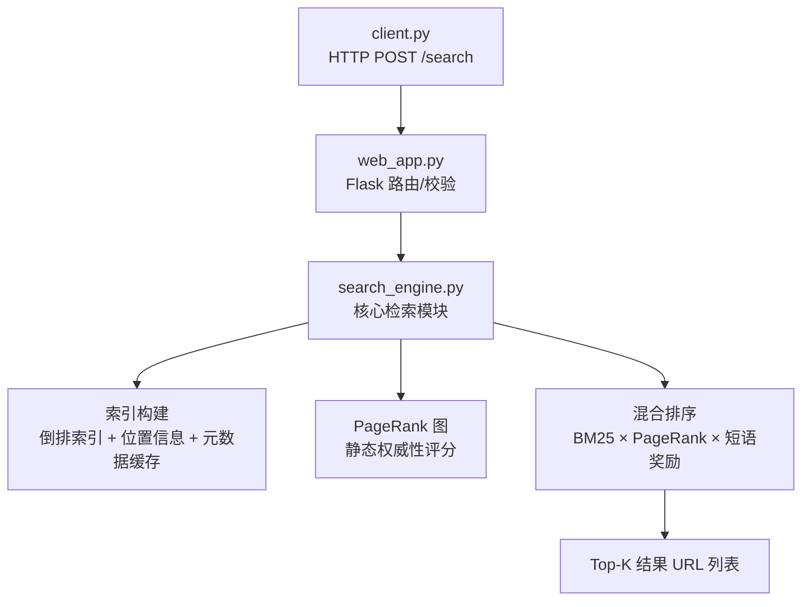

# 智能信息检索系统 (IR System)

> 为精准而生，为高 MRR 而优化。

[TOC]

## 项目概述

本项目是一个针对中国人民大学**科研处 (keyan.ruc.edu.cn)** 和 **学生处 (xsc.ruc.edu.cn)** 网站数据构建的高性能站内搜索引擎。系统深度优化排序算法，核心目标是在专业领域查询中获得尽可能高的 **平均倒数排名 (Mean Reciprocal Rank, MRR)**，为用户提供精准、权威、高效的信息检索服务。

## 🚀 核心特性

- **MRR 优化排序模型**：采用 **BM25** 作为核心相关度算法，并将 **PageRank** 作为乘法权重项进行融合，提升权威性与准确性。
- **专业数据源**：精准覆盖人大科研处与学生处网站，提供高度垂直的学术与学工信息检索。
- **高级查询理解**：
  - **词性标注过滤 (POS Tagging)**：分词阶段过滤低信息量词汇，只保留名词、机构名等核心概念词，提升查询“纯度”。
  - **最长连续短语奖励**：对在文档中完整、连续匹配查询短语的结果给予显著加分，是提升 MRR 的关键策略。
- **智能降权惩罚**：对“目录页”等导航性质页面进行降权，优先展示实质内容页。
- **高性能索引**：采用包含位置信息的倒排索引，支持毫秒级响应；首次查询时惰性构建。

## 🏗️ 系统架构

### 后端数据流 (Mermaid)

> GitHub 已原生支持 Mermaid 渲染。



### 前端结构 (示意)

```text
templates/index.html （主页面模板）
├─ static/css/style.css （样式）
└─ static/js/script.js （交互逻辑）
```

## 📁 项目结构

```text
IR_System/
├── search_engine.py          # 搜索引擎核心算法（索引构建与排序）
├── web_app.py                # Flask Web 应用，提供 /search 接口
├── templates/                # HTML 模板
│   └── index.html            # Web 界面（可选，主要为 API 服务）
├── static/                   # 静态资源 (CSS, JS, 图像)
│   ├── css/
│   ├── js/
│   └── imgs/
├── crawler_data/             # 爬虫与数据
│   ├── data_output/          # 结构化数据（JSON）
│   └── html_output/          # 原始 HTML 备份
└── data_process/             # （可选）数据预处理脚本
    ├── fix_json_titles.py      # 标题修复脚本
    └── export_titles_to_csv.py # 数据导出与分析脚本
```

## 🔍 搜索引擎核心 (search_engine.py)

### 算法与优化策略

1. **BM25 排序算法**
   - 词频-逆文档频率的经典相关度模型，作为排序基石。
   - **标题权重增强**：标题中的词汇在索引中被复制 3 次，显著提升标题相关性。
   - **可调参数**：`K1 = 1.5`, `B = 0.75`。

2. **PageRank 权威性加权**
   - 基于页面链接结构计算静态权威性分数。
   - **乘法融合**：通过权重系数 `PAGERANK_WEIGHT` 将 PageRank 与 BM25 分数做乘法融合，使其对所有候选结果生效。

3. **MRR 优化策略**
   - **最长连续短语奖励**：查询词在文档中连续匹配的长度越长，奖励越高（上限 `PHRASE_BONUS_CAP`），可显著前移精确匹配结果。
   - **目录页降权**：若元数据 `page_type == "directory"`，分数乘以惩罚系数 `DIRECTORY_PAGE_PENALTY`。
   - **词性标注过滤 (POS Tagging)**：利用 `jieba.posseg`，仅索引名词、机构名、英文等高价值词性 (`ALLOWED_POS_TAGS`)，减少噪音。
   - **定制停用词表**：结合领域停用词（如“我校”“通知公告”“开展”等）进一步提升精准度。

### 索引构建与缓存

- **惰性初始化**：首次调用检索时在内存构建索引。
- **位置信息索引**：倒排列表存储词元出现位置，为短语匹配提供支撑。
- **元数据缓存**：缓存文档长度、URL、页面类型等信息以加速排序计算。

## 🌐 Web 应用 (web_app.py)

- **核心 API**：`/search`（POST）—— 接收 JSON 查询，返回 URL 列表。
- **调试接口**：`/api/search`（GET）—— 浏览器快速验证。

### 接口示例

**POST /search**

```bash
curl -X POST "http://localhost:8080/search" \
  -H "Content-Type: application/json" \
  -d '{"query":"科研处 项目申报 2024","top_k": 20}'
```

**可能的返回**

```json
{
  "results": [
    "http://keyan.ruc.edu.cn/xxx1.html",
    "http://xsc.ruc.edu.cn/xxx2.html"
  ]
}
```


## 🚀 快速开始

### 环境要求

- Python 3.7+
- pip

### 安装依赖

```bash
pip install flask jieba
```

> 备注：PageRank 的实现可采用自研或第三方库；如需使用第三方方案，请自行在 `requirements.txt` 中补充。

### 启动服务

```bash
python web_app.py
```
- 默认监听：`http://localhost:8080`
- 日志提示如包含 `* Debug mode: on`，该模式仅用于本地开发。


## 🔧 核心参数配置（位于 `search_engine.py` 顶部）

```python
# 标题权重
TITLE_TOKEN_DUP = 3

# BM25 参数
K1 = 1.5
B = 0.75

# MRR 优化参数
PHRASE_BONUS_WEIGHT = 0.5   # 短语奖励基础权重
PHRASE_BONUS_CAP = 3.0      # 短语奖励倍数上限
DIRECTORY_PAGE_PENALTY = 0.8 # 目录页惩罚系数
PAGERANK_WEIGHT = 0.15      # PageRank 融合权重

# 词性标注配置
ALLOWED_POS_TAGS = {'n', 'vn', 'eng', 'nt', 'ns'}
```

## 📊 数据处理与修复

- `fix_json_titles.py`：修复因爬虫规则导致的标题异常（如被统一识别为“科研处”“通知公告”等）。
- `export_titles_to_csv.py`：导出文档编号、标题、URL 等信息至 CSV，便于抽样检查与数据清洗。

## 🧪 评测与优化建议

- **主指标**：MRR（Mean Reciprocal Rank）。
- **建议**：
  - 对“短语奖励”进行网格搜索（`PHRASE_BONUS_WEIGHT` / `PHRASE_BONUS_CAP`）。
  - 针对“目录页惩罚”与 `PAGERANK_WEIGHT` 做联合调优，避免过拟合。
  - 建立小规模人工标注集，进行稳定性回归测试（不同日期/不同站点栏目）。

## 🤝 贡献

欢迎通过 Issue 交流优化思路，或提交 PR 共同完善。请在提交前确保：
- 通过基础单元测试；
- 补充或更新 README 与注释；
- 对关键参数改动附带对比实验结论（MRR/Top-1 命中等）。

## 📄 许可

此项目的许可协议可根据实际需要自行选择（如 MIT/Apache-2.0 等）。
如未指定，默认**保留所有权利**，禁止未授权商用与二次分发。
